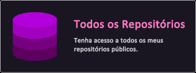

    

<h1 align="center"> Alô &ltdev/&gt, Paulo Aqui! 😊</h1>

### ℹ️ Sobre Mim
Sou estudante de ciência da computação e gosto muito de desenvolvimento web e de games, trabalho tanto com a parte funcional (backend) quanto com a parte estética (frontend) de meus projetos, quando tenho algum problema no meu dia-a-dia tento resolver desenvolvendo um pequeno aplicativo e aproveito pra aprender alguma tecnologia que eu ainda não conhecia.

  

    
⚡ Mais Detalhes

    <ul>
    <li>🌱 Atualmente estou me aprofundando em:</li>
    <ul>
        <li>
             
             
            Unity Engine
        </li>
        <li>
                 
            React.js
        </li>
        <li>
                 
            React Native
        </li>
    </ul>
    <li>
        ⚡ Fato divertido: Gosto muito de tudo relacionado a 
    </li>
    <li>
        📫 Vamos nos conectar!: <a href="https://paulo-sergio.carrd.co/">🎴 Cartão de Visitas</a>.
    </li>
</ul>

## 🔗 Atalhos

    Se estiver com pressa💨, talvez possa te ajudar! Alguns atalhos úteis:

    
    &nbsp;&nbsp;
    

## 📊 Minhas Estatísticas

    
    &nbsp;&nbsp;
    
     
     
    

